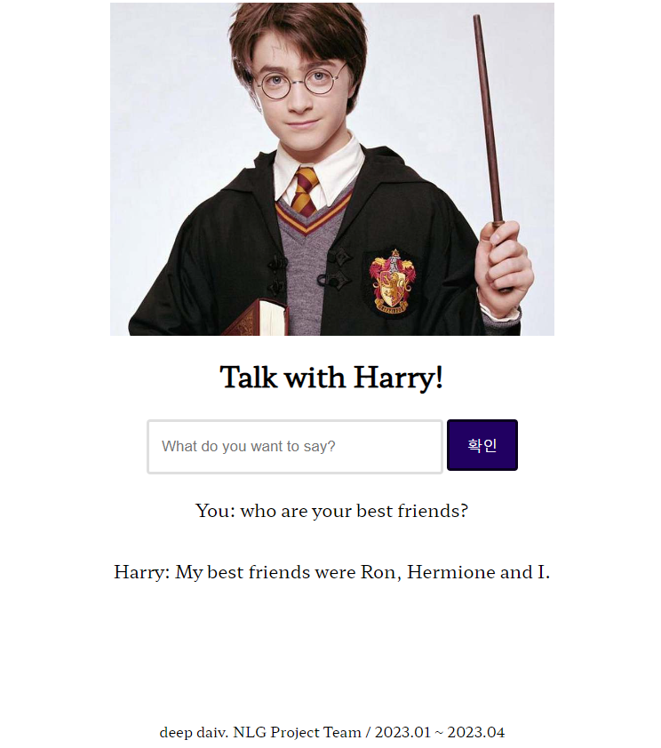
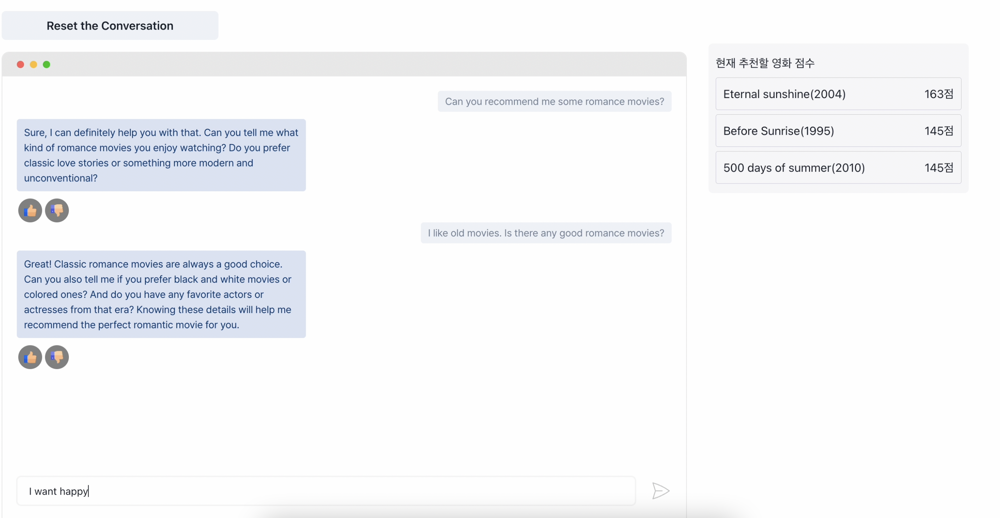
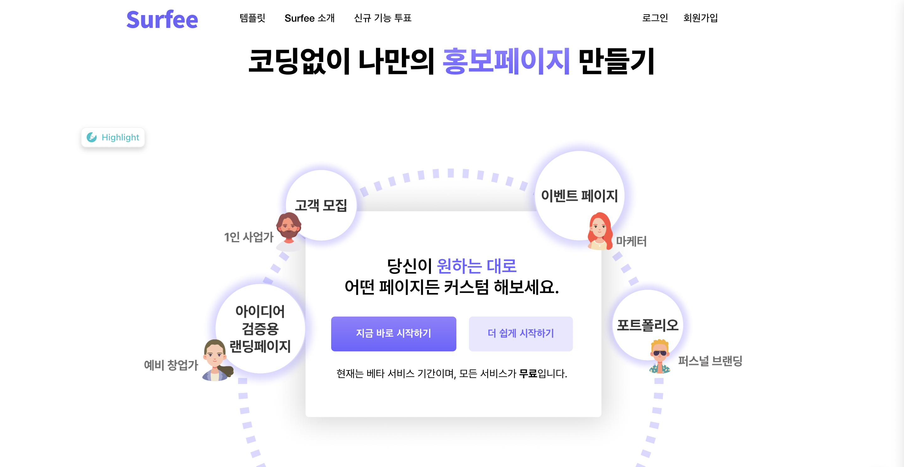

  

<h2>Interests</h2>

<code>Language model</code>
<code>Conversational System</code>
<code>Information processing</code>
<code>Diffusion</code>

 
<h2>My works</h2>

| <a href="https://github.com/thxxx/TextualSpace">Text space</a> | <a href="https://github.com/thxxx/potters">Harry potter</a> |
| :------------------------------------------------------------: | :---------------------------------------------------------: |
|                        Text space 내용                         |                                   |

| <a href="https://github.com/thxxx/crs">ReelTaco</a> |   <a href="https://github.com/thxxx/kiwi">Surfee</a>   |
| :-------------------------------------------------: | :----------------------------------------------------: |
|    Dataset : 21,721   |  Nocode Landingpage Saas |
